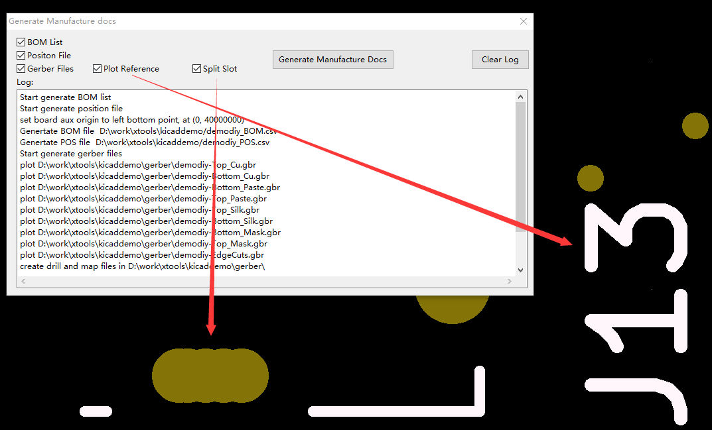
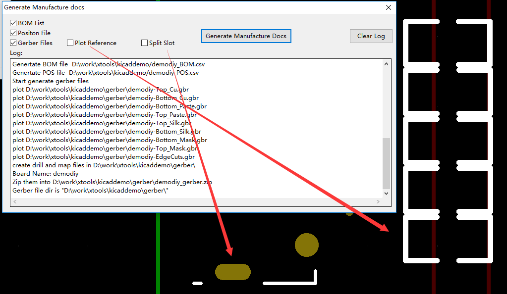

# KiCad EDA 生产文件生成器


[TOC]

## 中文说明

本插件可一键生成 PCB 的 Gerber、钻孔、BOM 物料清单、坐标文件。

### 安装

适用于：KiCad EDA 5.1.0 +

* Windows 安装命令
    ```
    git clone https://github.com/xtoolbox/kicad_tools.git %appdata%/kicad/scripting/plugins/kicad_tools
    ```
* Linux 安装命令
    ```
    // TODO
    ```

### 使用

安装完成即可使用，找到 `工具` -> `外部插件` -> `Gen Manufacture Docs` 打开插件界面，点击插件界面上的 `Gen Manufacture Docs ` 按钮执行命令。


### 生成文件

当 `BOM List` `Positon File` `Gerber Files` 全选时，点击 `Generate Marnufacture Docs` 按钮后插件会一键生成 BOM 物料清单、坐标文件、Gerber 文件、钻孔文件。

BOM 文件和坐标文件会以 CSV 格式存放在电路板同级目录下，Gerber 和钻孔文件放在电路板目录下的 gerber 目录中，通过 `Split Slot` 此选项生成的钻孔文件中的槽孔会被转换成多个普通孔。

生成的文件可以直接在 sz-jlc.com 进行贴装。

### 注意事项

GenMFDoc() 会改变电路板的钻孔原点，建议先用GenMFDoc() 生成 BOM 清单和位置文件，再生成 Gerber 文件。

### 参考

KiCad plot tool is forked from "https://github.com/blairbonnett-mirrors/kicad/blob/master/demos/python_scripts_examples/gen_gerber_and_drill_files_board.py"

S-Expression parse tool is forked from https://github.com/tkf/sexpdata


# Manufacture Tools for kicad

Usage:

step 1: Copy the mf_tool.py gerber_drill.py loadnet.py and sexpdata.pyto “[kicad install path]\share\kicad\scripting\plugins”

step 2: In Python console window, type 
```python
import mf_tool as mf
mf.GenSMTFiles()
```

step 3: or in [tools]->[external tools] menu, invoke the [Gen Manufacture Docs] command.

step 4: the BOM and Postion CSV file will be generated under the same folder of the board file。 Gerber and drill file is under the "gerber" folder. The slot hole in drill file will split to hole serires. Send them to jlcpcb.com to get a PCBA.

## Attention:

The GenMFDoc() command will change the Aux original point

## Preivew






